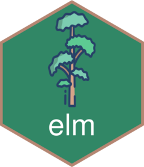

<!-- README.md is generated from README.Rmd. Please edit that file -->

```{r, include = FALSE}
knitr::opts_chunk$set(
  collapse = TRUE,
  comment = "#>",
  fig.path = "man/figures/README-",
  out.width = "100%"
)
```

# elm 

<!-- badges: start -->
<!-- badges: end -->

Elm is a disk usage analyzer tool that allows you to visualize 
file size on your computer in an interactive way. With elm, you can 
view your file sizes in a variety of different ways, including by name, size, 
type, and relation. Elm makes it easy to gain insights into the files 
on your computer, helping you to manage your storage more effectively.

## Installation

You can install the development version of elm like so:

``` r
# install.packages("devtools")
devtools::install_github("parmsam/elm")
```

## Examples

```{r example}
library(elm)
```

## RStudio addins
After installing the package, you will see RStudio addins to generate file visualizations for your current working directory. 

## Interactive plots
You can interactively explore your disk usage using `elm_sunburst_files()`. Disk usages is displayed in bytes. Note that plots in this package may be slow to load or fail to load if there are a lot of child nodes in the file tree. If that happens, I'd recommend changing the working directory or folder path in the path argument.
```{r, eval = FALSE}
elm_sunburst_files(path = ".") #recursive look at all files in current path
```
Alternatively, you can visualize your folders or files as a treemap using the `elm_treemap_*()` function. By default the `interactive = TRUE` and `path="."`. You can use `?elm_treemap_files()` to learn more. 
```{r, eval = FALSE}
elm_treemap_files(path = ".") #recursive look at all files in current path
```
<!-- # elm_treemap_folders(path = ".") #same with folders only instead -->
## Static plots
Alternatively, you can set interactive to FALSE to get static versions for some plots.
```{r, out.width = "350px"}
elm_treemap_files(interactive = FALSE)
```

## Folders or files tree
Here's an example of how you can print and copy the folders in your current directory in a tree-like format using `elm_clip_folders()` (note that the file size isn't included here). Note that this is just a wrapper to `fs::dir_tree()` with a capture content and clipboard copy via `clipr::write_clip()`.
```{r}
elm_clip_folders()
```
Or you can use `elm_clip_files()` to print and copy the files in your current directory in a tree-line format (note that the file size isn't included here). Note that this is just a wrapper to `fs::dir_tree()` with a capture content and clipboard copy via `clipr::write_clip()`.
```{r, eval=FALSE}
elm_clip_files()
```

## Credits 

- Hex icon created using the [hexmake
app](https://connect.thinkr.fr/hexmake/) from
[ColinFay](https://github.com/ColinFay/hexmake).
- <a href="https://www.flaticon.com/free-icons/elm" title="elm icons">Elm icons created by Icongeek26 - Flaticon</a>

## Contributing

Are you interested in learning how you can contribute to this package? Head over to the [contributor guide](CONTRIBUTING.md).

## Code of Conduct

Please note that the elm project is released with a [Contributor Code of Conduct](https://contributor-covenant.org/version/2/1/CODE_OF_CONDUCT.html). By contributing to this project, you agree to abide by its terms.
